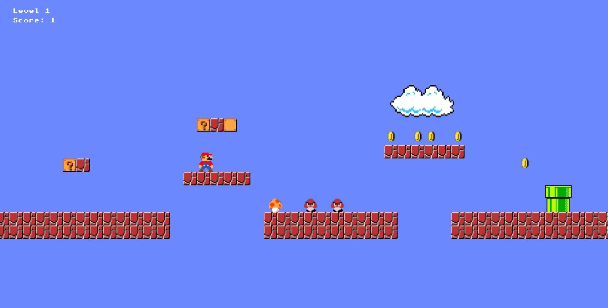
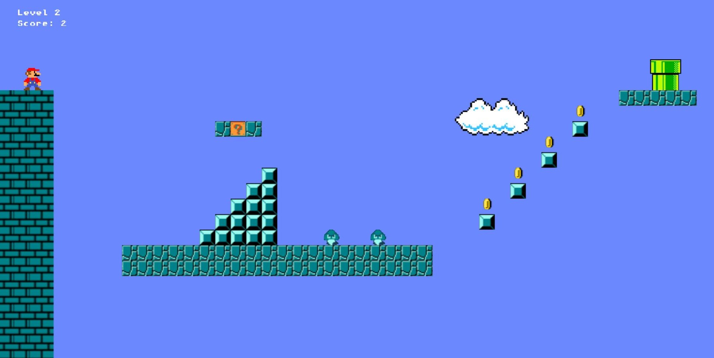
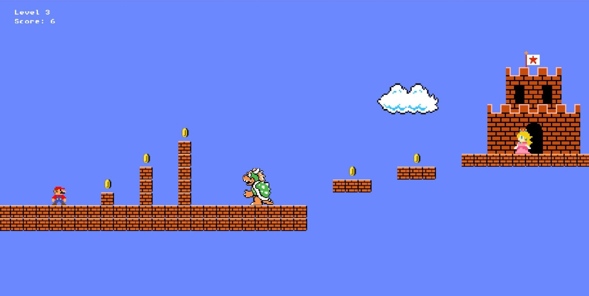

# About

Super Mario game built in Javascript using Kaboom.js

More levels coming soon

# Levels

Level1

Level2

Level3 (Currenty final level)

# Setup

Download the project and open index.html

# How to play

In order to win the game you have to help Mario save Princess Peach.
Use space key to jump and left and right arrow keys to move.

Kill the enemies by jumping on top of them and get special surprises by bumping Marios head into blocks marked with a question mark.
Eating mushrooms makes Mario grow, but it's only temporary.
Sliding down the pipe leads you to the next level.

